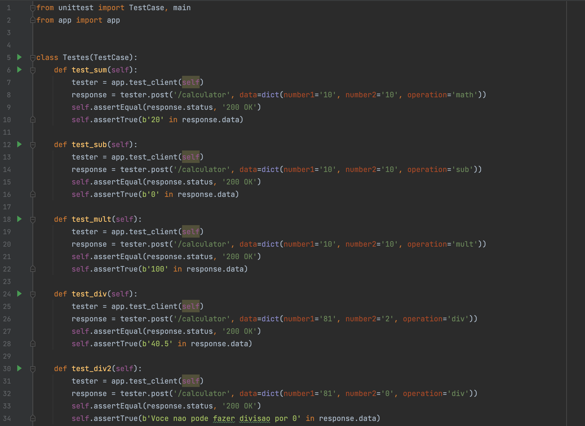
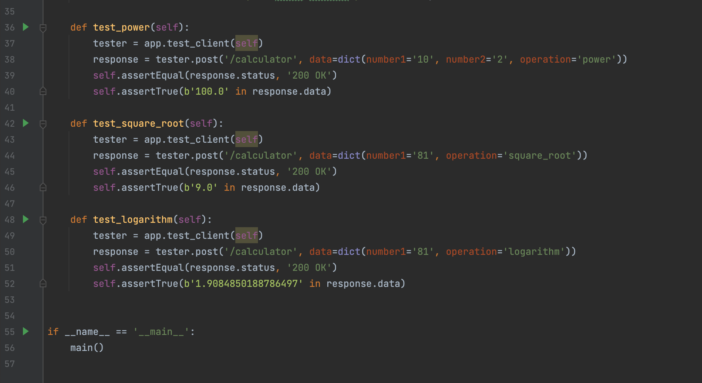
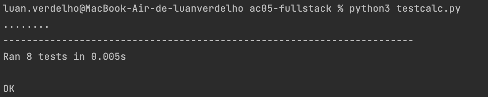
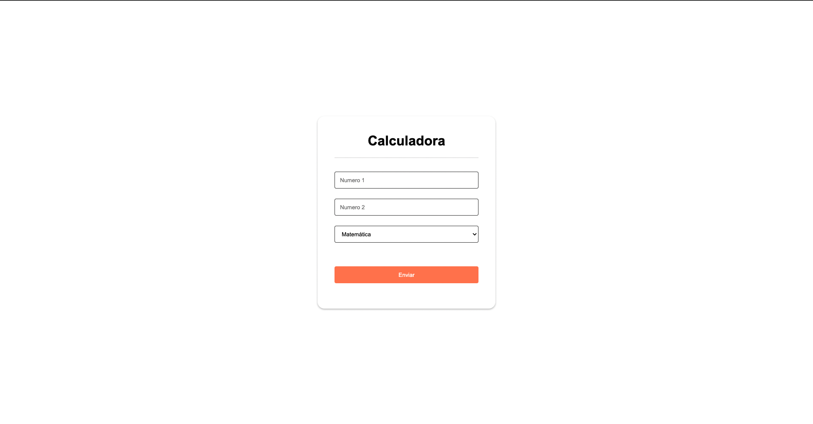
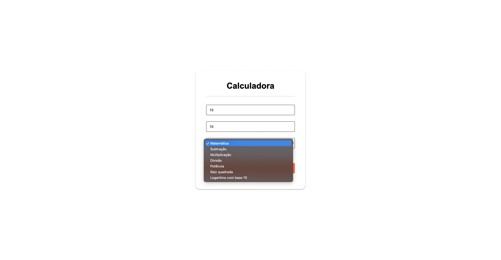
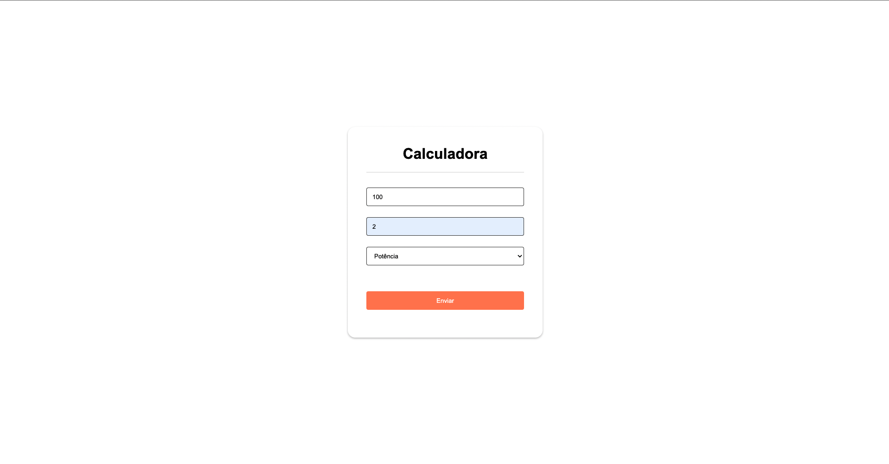
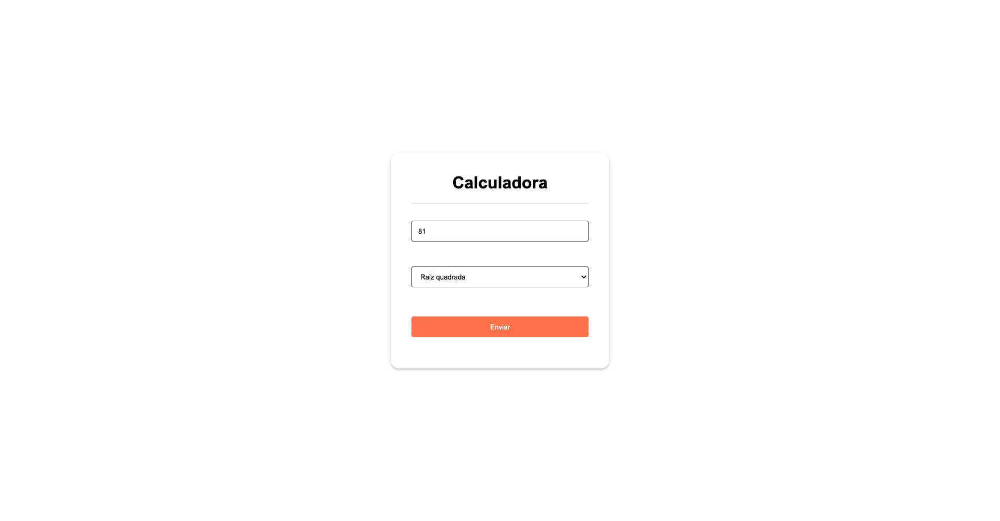
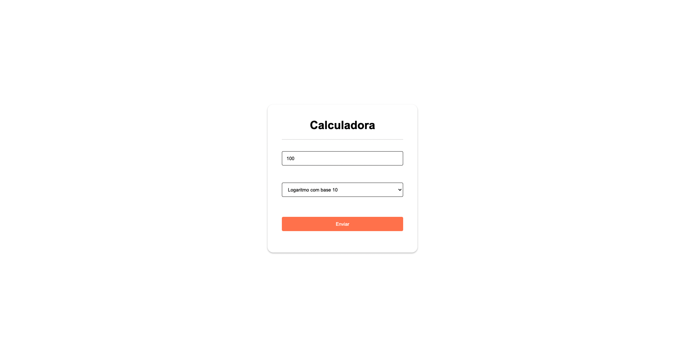

# Atividade continua 05

Projeto de calculadora com testes unitários, com operações de raiz quadrada, exponenciação e logaritmo

## Participantes
1. Luan Verdelho de Freitas | RA: 1905364
2. Yasmin Leandra Pereira da Silva | RA: 1904614

## Projeto
O projeto é feito no modelo MVC, utilizando css e javascript. O javascript é usado para duas operações que não necessitam de um segundo número como a raiz quadrada e o logaritmo

## Como executar
Executa rodando o `flask run` e vai ter um formulário</ br> da calculadora

para rodar os testes rode  `python testcalc.py ` ou `python3 testcalc.py`

# Teste unitário
Segue as imagens do código dos testes unitários:

## Resultado do teste

## Principais Telas

### soma

### Divisão

### Potência

### Raiz quadrada

### Logaritmo com base em 10

